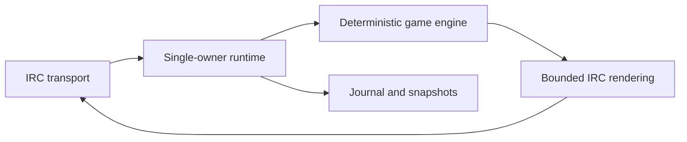

# pyDuckHunt

[](https://github.com/teuk/pyDuckHunt/actions/workflows/ci.yml)
[](#beta-status)
[](https://www.python.org/)
[](LICENSE)

pyDuckHunt is a fast, deterministic IRC game bot written in Python.

The project is designed around a latency-sensitive command path, explicit
state transitions, durable recovery and replayable tests. Network transport,
game rules, rendering and persistence are isolated so each layer can be tested
without an IRC connection.



The sample configuration is disabled and points to reserved `.invalid`
destinations. Nothing connects to IRC, installs a service or changes persistent
state merely by cloning or validating the repository.

## Beta status

pyDuckHunt is currently **beta software**. The live development pilot is being
evaluated, the public API and operator contracts may still evolve, and no tag
or GitHub Release has been published yet. Clone `main` only if you accept that
pre-release boundary.

The repository contains a validated project foundation, strict IRC message
contracts, deterministic game transitions and the durable player-profile core.
It does not connect to IRC automatically and does not install, enable or start
a service.

The persistence foundation provides a digest-chained journal, atomic snapshots
and deterministic recovery. A bounded background worker now owns journal and
snapshot I/O, while a single-owner orchestrator reserves capacity and enqueues
the priority response before committing its replay intent. The IRC layer now
includes strict incremental stream framing and a single-owner, process-neutral
connection state machine for registration, channel joins, PING/PONG, exact
reconnect backoff and clean shutdown. Its in-memory fake server exercises
fragmented traffic without a network connection. Strict TOML configuration,
explicit environment-secret resolution and non-blocking TCP or verified TLS
adapters now surround that state machine. Local socket-pair tests exercise the
wire boundary without network egress. A guarded process shell now bridges only
ready channel `PRIVMSG` commands to validated replay intents, queues bounded
responses through the adapter and closes persistence only after transport has
stopped. Settlement entropy remains injected and the sample stays disabled. A
foreground pilot CLI now exists behind an exact destination allowlist, enabled
configuration and literal live-target confirmation; no command runs it
automatically, and the separately packaged systemd candidate remains disarmed.

A concrete single-owner settlement adapter now supplies bounded shot and
standard-loot rolls, catalog magnitudes, scheduled deadlines, fatigue values
and target-presence facts. A separate development pilot gate requires both
configuration activation and an exact injected endpoint and channel allowlist.
Pilot composition recovers state but does not start a connection.
A UTC-anchored monotonic clock adapter now generates replayable daily plans,
skips missed slots without bursts and emits due flights through the same bounded
priority path. An operator runner starts only an already-authorized pilot and
stops through explicit thread-safe control. The CLI first offers a
side-effect-free preflight, then requires the same target plus its complete
printed confirmation before a foreground run. It writes a bounded operator
transcript and installs no service.
A separate `service-run` boundary converts `SIGTERM` and `SIGINT` into the same
bounded transport-first stop. The shipped systemd candidate remains inert until
an operator installs it with a root-controlled target authorization.

Profiles keep level progress, ammunition reserves, a canonical typed inventory
and active shop effects in the same immutable state used by replay. The first
calibrated shop slice settles purchases atomically and expires effects on the
monotonic game clock. Supported equipment now modifies deterministic shot
settlement, including resistant-target damage and replayable injected rolls.
Misses can now settle bounded cross-player incident chains, including
deflection, armor, confiscation and insurance, without consulting external
state. Targeted nuisance purchases now preserve their source, presence policy,
countermeasure and one-shot or timed behavior through deterministic replay.
Player profiles, inventory, shop, ranking and settled outcomes now have pure
French response projections with a four-line flood boundary and strict
target-specific 512-byte IRC framing.
`!duckstats` projects the complete two-notice hunting sheet, including global
experience and durable shot, jam, spending and accident totals. `!inventory`
keeps weapon and owned-item facts in the compact reference order.
The observed 1–31 shop surface is now catalogued. Delayed channel actions,
fatigue relief, targeted one-hour modifiers, automatic reload and purification
all cross explicit replay boundaries; no in-process timer or hidden random draw
enters settlement.
Shot fatigue now uses exact fixed-point centi-points, and every calibrated curse
modifies accuracy, reliability, ammunition, damage, rewards, reloads or timing
inside the same immutable transition. Delayed cursed commands expose a durable
deadline for the future runtime instead of blocking the event loop.
Standard, golden and mechanical targets now carry explicit persisted identities,
health and rewards. Standard kills may also carry one already-selected loot
award, including bounded equipment, experience or a level-gated curse; selection
entropy remains outside the transition and the exact award is replayed.
Observed unusual rewards now include durable shop vouchers, bounded promotion
coupons, abundance, endurance, blessing, baker and prankster amulets. Their
effects compose with purchases, fatigue, curses and channel actions while the
uncalibrated unusual-drop frequency remains explicitly disabled. A pure runtime
policy fixes new daily plans at 24 deadlines, retains replay compatibility for
historical 18- and 21-deadline plans, preserves the one-in-eighteen golden
weight, golden health and the five-minute flight lifetime without reading a
clock or drawing randomness inside the game engine.
The observed permanent protection set now also covers indestructible
sunglasses, a tearproof raincoat, military self-lubrication and a permanent
killing license. These unique inventory facts counter glare, water, sand, jam
risk or incident penalties without an expiring effect or hidden settlement.
Profiles now also preserve the eight ordered `DUCK HUNT` letter slots and their
daily carried-duck count. Exact fatigue bands, the Europe/Paris midnight reset, a 24-hour TARDIS
exemption and the concrete collection-completion bundle all survive journal
replay while keeping player output flood-safe.
The daily plan and cursor now survive snapshots and journal replay. Exact ticks
dispatch only already-selected targets, while restart ticks consume missed
deadlines without a catch-up burst. Public command and purchase adapters enforce
durable per-player and channel-wide rolling windows before entering the game
transition, with a one-minute bound on throttle notices.
Startup recovery, full-queue backpressure, asynchronous failure latching and
draining shutdown now have explicit process-neutral contracts. The worker keeps
an independent replay state for periodic and final snapshots, and no disk call
runs on the priority-response path.
A calibrated behavioral suite now replays six synthetic cross-domain traces and
checks recovery from every possible snapshot boundary. It preserves observed
game contracts without publishing raw IRC logs or opening a network connection.
Foreground pilot telemetry now exposes only lifecycle states and aggregate
command or schedule counts. It proves that IRC READY was reached without
recording channel text or player identities, and a run that never becomes ready
cannot report operational success.

An optional Eggdrop-style Coin partyline now shares the single-owner runtime.
It supports a loopback TCP listener, active and server-offered DCC CHAT,
allowlisted first-owner bootstrap, private hashed credentials, room broadcast,
live Coin/DuckHunt status, player inspection and replayable bounded player
administration. It is absent and disabled by default; see `docs/PARTYLINE.md`.
Authenticated owners can also launch standard or golden ducks on a joined
channel without altering the autonomous daily schedule. `.summary` combines
the configured top-five ranking with each player's canonical profile and
inventory, plus the durable last shooter. The registered owner can also use
IRC `!rearm` and `!unarm [-permanent]`; account or exact bootstrap-prefix
matching prevents nickname-only authorization, and every accepted weapon
change is replayable. The same owner check protects private
`ducklaunch #channel [1]` requests. An optional randomized timer can add a
standard unplanned flight with a configurable preflight announcement; skipped
or accepted attempts draw a new interval and never move the daily cursor.

An optional deterministic ranking exporter now projects the same stable order
as IRC `!top` into a standalone responsive HTML page after durable journal
updates. Its least-privilege publication pattern keeps Coin outside the Apache
document root and delegates one validated root-owned file replacement to a
hardened path/`oneshot` pair. See `docs/RANKING_PAGE.md`.

## Current beta gameplay

The daily base is fixed at 24 flights. Active bread lasts one hour across
flights, adds 20 seconds per piece to new ducks and replans method-2 attraction
at 24 + active pieces (up to 20 pieces). The next deadline is preserved on
addition and partial expiry; attraction guarantees no extra flight within the
hour. Paid calls wait durably for an available flight slot. See
[Channel actions](docs/CHANNEL_ACTIONS.md).

Owner-only `!duckplanning`, private-message `duckplanning` and partyline
`.duckplanning` expose every planned time and pending action. Owner item replies
stay private. Player replies reveal no exact future takeoff time.

Profiles show the current scope, fatigue and overexcitation modifiers used by
live shots. Scope purchases keep six uses and a calculated bonus; new thermos
purchases set fatigue to -3.00. Ordinary ducks flee after three unsuppressed
misses, while golden/mechanical ducks are immune to noise. Silencers and silent
weapons prevent noise. See [Shop rules](docs/SHOP.md) and
[Player profiles](docs/PLAYER_PROFILE.md).

The generated ranking provides responsive player cards and complete inventory
previews. An optional exclusion list keeps non-playing operators out of every
statistical view without erasing their records. State schema 23 retains old
replay decisions and preserves new counters and effects across restarts.

## Requirements

- Python 3.11 or newer
- Git

No third-party runtime dependency is required by the bootstrap foundation.

## Quick start

```bash
./install.sh
.venv/bin/pyduckhunt --help
```

The installer creates a project-local virtual environment and, when absent, a
mode-`0600` configuration copied from the disabled example. It never connects
to IRC, starts a process or installs a system service. See
[Installation](docs/INSTALL.md) for the complete first-run and upgrade path.

## Validate

```bash
export PYTHONPATH=src
.venv/bin/python tools/project_guard.py
.venv/bin/python -m compileall -q src tools tests
.venv/bin/python tools/validate.py --lane fast --progress
```

The complete lane is intentionally explicit:

```bash
PYTHONPATH=src .venv/bin/python tools/validate.py --lane full --progress
```

The separately commanded development workflow is documented in
`docs/OPERATOR_PILOT.md`. Running `pilot-check` does not connect; `pilot-run`
does connect after exact confirmation.

The uninstalled service candidate and its separate authorization boundary are
documented in `docs/SYSTEMD_SERVICE.md`.

The optional public ranking and its split generation/publication boundary are
documented in `docs/RANKING_PAGE.md`.

Aggregate Prometheus metrics, the loopback-only exporter and the provisioned
Grafana dashboard are documented in `docs/METRICS_GRAFANA.md`.

Partyline bootstrap, DCC modes, configuration and administration commands are
documented in `docs/PARTYLINE.md`.

## Repository policy

Only synthetic test data belongs in the repository. Runtime secrets, state,
logs and private research inputs are excluded.

## License and credits

pyDuckHunt is available under the Creative Commons
Attribution-NonCommercial-ShareAlike 3.0 Unported license. See [LICENSE](LICENSE).

Credits: [MenzAgitat](https://scripts.eggdrop.fr/details-Duck+Hunt-s228.html)
